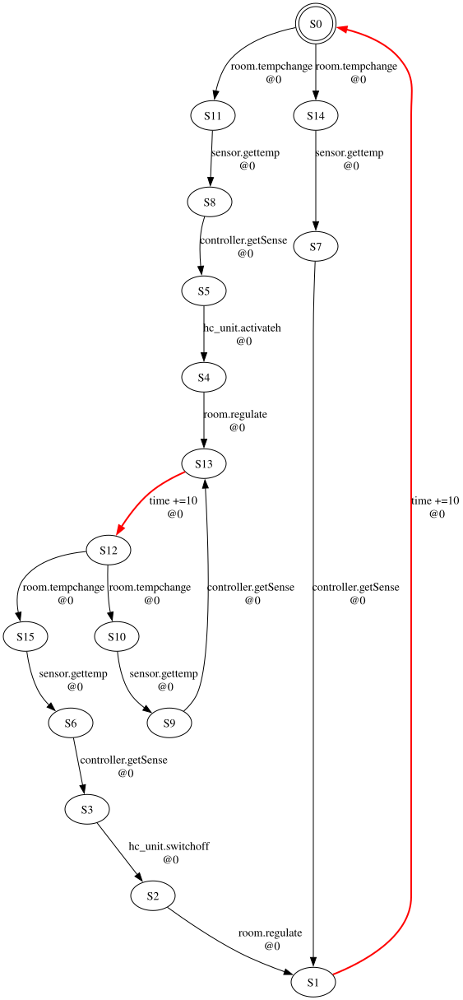
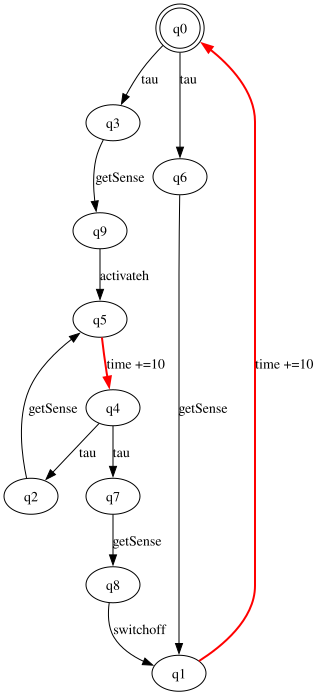
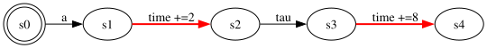
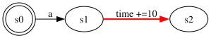
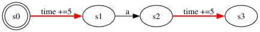
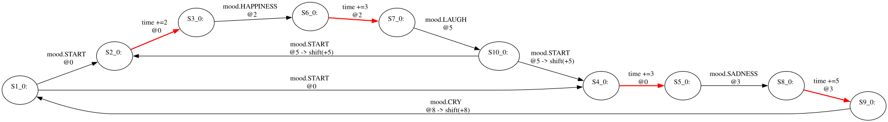
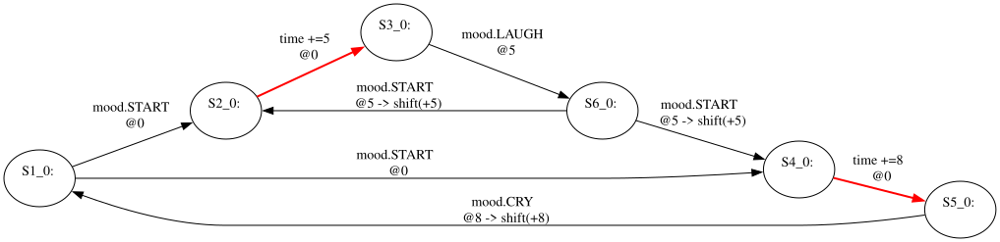

# awtr — Afra weak timed reduction

Reduces an Afra/RMC Timed Rebeca state-space export modulo **weak timed
bisimilarity** over discrete time, and writes out the quotient transition system.

Given a `.statespace` file and the set of message servers you care about, it
hides everything else as internal, merges the states that are indistinguishable
to an observer who can see only those interactions and the passage of time, and
produces a smaller transition system with the same observable timed behaviour.

```
$ awtr reduce smarthome.statespace --observable getSense,activateh,switchoff --output-dir out
model              smarthome.statespace
observable actions getSense,activateh,switchoff
time semantics     unit
original           16 states, 18 transitions
reduced            10 states, 12 transitions
reduction          37.5% states, 33.3% transitions
verification       relation is a weak timed bisimulation (34 pairs, 172 transfer checks)
```

## Before and after

<table>
  <thead>
    <tr>
      <th width="50%">Original Afra-format state space</th>
      <th width="50%">Verified weak-timed quotient</th>
    </tr>
  </thead>
  <tbody>
    <tr>
      <td width="50%" valign="top">
        <a href="docs/images/smarthome-original.svg">
          
        </a>
      </td>
      <td width="50%" valign="top">
        <a href="docs/images/smarthome-reduced.svg">
          
        </a>
      </td>
    </tr>
    <tr>
      <td align="center">16 states · 18 transitions</td>
      <td align="center">10 states · 12 transitions</td>
    </tr>
  </tbody>
</table>

Both diagrams come from `evaluation/models/smarthome.statespace`. The quotient
keeps `getSense`, `activateh` and `switchoff` observable; every other interaction
is hidden as `tau`. Red edges represent the passage of time. Click either image
to open the full-size SVG.

## Build and test

Java 17 and Maven 3.9+ are required. Both are pinned to what the official Afra
toolchain uses; see [docs/afra-integration.md](docs/afra-integration.md).

```bash
mvn clean package                      # compiles, runs 116 unit tests, builds target/awtr.jar
python3 tests/e2e/run_e2e.py           # 62 end-to-end checks against the packaged jar
python3 evaluation/run_evaluation.py   # regenerates evaluation/results.csv
```

`mvn test` alone runs the unit suite, which includes both acceptance oracles:
the ten recorded legacy weak-timed cases and the owner-provided Case II
diagrams.

## Commands

```
awtr reduce MODEL.statespace --observable NAME[,NAME...] [options]
awtr equivalent A.statespace B.statespace --observable NAME[,NAME...] [options]
awtr inspect MODEL.statespace
awtr visualize MODEL.statespace [--output FILE|-]
```

| option | meaning |
| --- | --- |
| `--observable NAME[,NAME...]` | message servers to keep visible; everything else becomes internal. A bare name matches any owner; `owner.name` matches one owner. Required — pass an empty value to hide everything. |
| `--method union\|reduced-iso\|reduced-iso-spliced` | how `equivalent` decides (default `union`); see below |
| `--output-dir DIR` | where the artefacts go (default `awtr-output`) |
| `--initial-state ID` | override the document-order default |
| `--time-semantics unit\|strict` | whether a `d`-unit delay may be observed part way through (default `unit`) |
| `--max-intermediate-states N` | cap on states added by unit refinement |
| `--no-verify` | skip the independent quotient check |
| `--output FILE\|-` | visualization output path; `-` writes DOT to standard output |

Exit codes: `0` success, `1` not equivalent or verification failed, `2` invalid
input, `3` internal error.

### Two ways to decide equivalence

`equivalent` defaults to `--method union`: both models go into one disjoint
union, that union is refined once, and the answer is whether the two initial
states landed in the same class.

`--method reduced-iso` never relates the two models at all. It reduces each one
separately to its *saturated* quotient — one state per class, with the edges
given by the weak transition relation rather than by the edges the model happens
to be written with — and tests those two for isomorphism. That form is
canonical, so the two methods decide the same question; the proof, the
counterexample that rules out the cheaper-looking form, and the measurements are
in [docs/experiments/quotient-isomorphism.md](docs/experiments/quotient-isomorphism.md).
It is the method to reach for when one model is compared against many, since
each reduction is computed once.

```
$ awtr equivalent smarthome.statespace smarthome-notify.statespace \
      --observable getSense,activateh,switchoff --method reduced-iso
WEAK_TIMED_BISIMILAR
method             reduced-iso
time semantics     unit
left               16 states, 18 transitions  ->  28 reduced states, 38 reduced transitions
right              42 states, 52 transitions  ->  28 reduced states, 38 reduced transitions
witness            28 states matched without backtracking
```

`--method reduced-iso-spliced` compares the quotient `reduce` writes instead.
That quotient is smaller and far more readable, but it is **not** canonical: it
can call two equivalent models different. It is kept as the experimental
subject, and warns on stderr.

`inspect` is the quickest way to find out what an export actually contains
before choosing an observable set:

```
$ awtr inspect smarthome.statespace
states             16
transitions        18
initial state      S0
delay durations    [10]
message servers
  room.tempchange  (sender=)
  sensor.gettemp   (sender=)
  controller.getSense  (sender=)
  ...
```

`visualize` is the headless counterpart of Afra's **ConvertToGraphviz** command.
It reads a complete, reduced, or unterminated RMC `.statespace` export and writes
deterministic Graphviz DOT without requiring Afra or any third-party Java
dependency:

```bash
java -jar target/awtr.jar visualize model.statespace --output model.dot
dot -Tpng model.dot -o model.png

# Or stream directly into Graphviz:
java -jar target/awtr.jar visualize model.statespace --output - \
  | dot -Tsvg -o model.svg
```

The graph uses Afra's conventions: the initial state is a double circle,
message-server edges show `owner.title`, execution time and shift are retained,
and time-progress edges are bold red. Only the second command requires Graphviz.

### Generate `.statespace` from Rebeca without the GUI

The RMC command-line entry point bundled in Afra can generate a TTS model
checker, compile it, and export the `.statespace` that this project consumes.
The repository includes a wrapper for the complete pipeline:

```bash
python3 tools/rebeca_to_statespace.py \
  src/test/resources/afra/rebeca/*.rebeca \
  --output-dir src/test/resources/rebeca-generated
```

It requires Java 17+ and a C++11 compiler, but does not start Afra. See
[docs/rebeca-generation.md](docs/rebeca-generation.md) for the toolchain roles,
exact versions, output paths, and verified results for all seven example models.

## Output

| file | what it is |
| --- | --- |
| `reduced.json` | **the primary result.** The reduced system, losslessly: labels, class membership and the observable set together |
| `partition.json` | which class each input state landed in, and where it sits in the reduced model |
| `reduced.statespace` | the same system in Afra's own dialect, so it feeds back into `StateSpaceTransformer`. A lossy view — see below |
| `reduced.dot` | Graphviz, labelled the way Afra labels it |
| `metrics.json` | counts, ratios, runtime, peak heap, input hash, tool version, commit |

`reduced.statespace` is deliberately not the primary artefact: Afra's schema has
one `sender` slot per transition, but a quotient edge can stand for several
original transitions with different senders, and there is nowhere to record
class membership.

## Headless use

`Cli` only parses arguments. The whole workflow is one call:

```java
var request = ReductionRequest.of(ObservableSet.of(List.of("getSense", "activateh")));
var result  = ReductionService.reduce(new AfraStateSpaceSource(path), request);

result.reducedStateCount();      // the numbers
result.quotient().system();      // the reduced model
result.verified();               // did the independent check pass
new ArtifactWriter(outDir).writeAll(result, path.toString(), hash, version, commit);
```

## Input

An unmodified Afra/RMC export produced with **TTS** semantics. FTTS exports
carry no explicit time steps and so have nothing to reduce.

Two properties of RMC exports drive the reader, both established from the
official emitter and generated fixtures:

* RMC 2.14 closes the root after a normal run, while interrupted or older
  streaming exports may be unterminated; the reader accepts both forms;
* the initial state is the first `<state>` written, which is also how Afra's own
  analysis loader identifies it.

[docs/afra-input-contract.md](docs/afra-input-contract.md) has the full contract
with the exact upstream revisions it was read from.

## Time semantics

The project pseudocode writes the weak delay closure as a *single* `d`-labelled
edge wrapped in internal steps. Definition 9 — and the pseudocode's own comment —
describe reachability by a run of total duration `d`.

Only the total elapsed time between observable actions matters; internal steps
do not split that observation into different behaviours. One of the Case II
models lets ten time units pass in one step; another lets seven pass, takes an
internal step, then lets three more pass. They are equivalent only if a delay
may be observed part way through and delay durations along an internally
interrupted run are accumulated. **That run-based semantics is the `unit`
default.**
`--time-semantics strict` is retained only as a diagnostic implementation of the
literal single-edge reading, with a test asserting the oracle fails under it.

### Internal actions and observable time

The following three systems make the observation rule concrete. The black edge
labelled `a` is observable, the black edge labelled `tau` is internal, and red
edges carry exact delays.

```text
TTS 1: s0 -a-> s1 -2-> s2 -tau-> s3 -8-> s4
TTS 2: s0 -a-> s1 -10-> s2
TTS 3: s0 -5-> s1 -a-> s2 -5-> s3
```

In this compact notation, `-d->` means that exactly `d` time units pass.

<table>
  <tbody>
    <tr>
      <th width="12%">TTS 1</th>
      <td><a href="docs/images/observable-then-split-delay.svg"></a></td>
    </tr>
    <tr>
      <th>TTS 2</th>
      <td><a href="docs/images/observable-then-delay.svg"></a></td>
    </tr>
    <tr>
      <th>TTS 3</th>
      <td><a href="docs/images/delay-observable-delay.svg"></a></td>
    </tr>
  </tbody>
</table>

For each diagram, `awtr visualize` reads the corresponding `.statespace`
fixture in `src/test/resources/readme/` and generates DOT, which Graphviz renders
as SVG. Those same files drive `ReadmeTimedExampleTest`, so the displayed models
and the asserted equivalence results have a single source of truth. The
lower-level in-memory version remains in `WeakTimedSemanticsTest` to test the
semantic core without the file parser.

In TTS 1, `a` happens immediately and is followed by `2 + tau + 8` time units.
In TTS 2, the same observable action happens immediately and is followed by one
10-unit delay. The internal `tau` is not observable and does not reset elapsed
time, so both systems expose the same timed behaviour: `a` at time 0, followed
by ten units without another observable action. They are weak timed bisimilar
under the default `unit` semantics.

TTS 3 also has a run lasting ten units, but its observable action occurs only
after five units. Hiding applies to internal actions, not to the time at which
an observable action occurs. An observer can therefore distinguish `a` at time
0 from `a` at time 5, so TTS 3 is not weak timed bisimilar to either TTS 1 or
TTS 2. `WeakTimedSemanticsTest.observableActionTimingDistinguishesRuns` pins
down all three pairwise results.

See [docs/semantics.md](docs/semantics.md).

### RMC-generated `mood` example

This example exercises the complete workflow rather than constructing a TTS by
hand:

```text
mood1.rebeca / mood2.rebeca
             |
             v  RMC 2.14, TTS semantics
mood1.statespace / mood2.statespace
             |
             +--> Afra StateSpaceTransformer --> DOT/SVG diagrams
             |
             +--> awtr weak-timed comparison --> equivalent
```

The Rebeca sources and their generated `.statespace` files are both committed,
so the diagrams and equivalence test can be traced back to the actual models.
The two complete source models are shown side by side below, formatted for
readability; their filenames link to the exact files used by the generator.

<table>
  <thead>
    <tr>
      <th><a href="src/test/resources/afra/rebeca/mood1.rebeca"><code>mood1.rebeca</code></a></th>
      <th><a href="src/test/resources/afra/rebeca/mood2.rebeca"><code>mood2.rebeca</code></a></th>
    </tr>
  </thead>
  <tbody>
    <tr>
      <td valign="top"><pre><code>// observable: mood.LAUGH,mood.CRY
reactiveclass MoodSystem(2) {
  statevars {
    boolean happyBranch;
  }
  MoodSystem() {
    happyBranch = false;
    self.start();
  }
  msgsrv start() {
    happyBranch = ?(true, false);
    if (happyBranch) {
      self.happiness() after(2);
    } else {
      self.sadness() after(3);
    }
  }
  msgsrv happiness() {
    self.laugh() after(3);
  }
  msgsrv laugh() {
    self.start();
  }
  msgsrv sadness() {
    self.cry() after(5);
  }
  msgsrv cry() {
    self.start();
  }
}
main {
  MoodSystem mood():();
}</code></pre></td>
      <td valign="top"><pre><code>// observable: mood.LAUGH,mood.CRY
reactiveclass MoodSystem(2) {
  statevars {
    boolean laughBranch;
  }
  MoodSystem() {
    self.start();
  }
  msgsrv start() {
    laughBranch = ?(true, false);
    if (laughBranch) {
      self.laugh() after(5);
    } else {
      self.cry() after(8);
    }
  }
  msgsrv laugh() {
    self.start();
  }
  msgsrv cry() {
    self.start();
  }
}
main {
  MoodSystem mood():();
}</code></pre></td>
    </tr>
  </tbody>
</table>

For the comparison, only `mood.LAUGH` and `mood.CRY` are observable;
`mood.START`, `mood.HAPPINESS`, and `mood.SADNESS` are internal.

In `mood1`, the happy branch waits 2 units, performs the internal
`mood.HAPPINESS` action, and waits another 3 units before `mood.LAUGH`. The sad
branch similarly waits `3 + 5` units around `mood.SADNESS` before `mood.CRY`.
`mood2` expresses the same observable timings with direct waits of 5 and 8.
Consequently, the two generated systems are weak-timed bisimilar under the
default `unit` semantics.

<table>
  <tbody>
    <tr>
      <th width="12%"><code>mood1</code></th>
      <td><a href="docs/images/rebeca-generated/mood1.svg"></a></td>
    </tr>
    <tr>
      <th><code>mood2</code></th>
      <td><a href="docs/images/rebeca-generated/mood2.svg"></a></td>
    </tr>
  </tbody>
</table>

The committed DOT files are produced by Afra's official
`StateSpaceTransformer`; Graphviz only lays them out as SVG. The complete
[`mood`, `teacher`, and `chain` gallery](docs/rebeca-visualizations.md) includes
the reproduction commands and explains Afra's edge labels.

## Results

From `evaluation/results.csv`, regenerated by `evaluation/run_evaluation.py`:

| model | states | transitions | reduction | verified |
| --- | --- | --- | --- | --- |
| tiny | 6 → 2 | 7 → 2 | 66.7 % | yes |
| smart-home | 16 → 10 | 18 → 12 | 37.5 % | yes |
| smart-home-tc2step | 25 → 10 | 28 → 12 | 60.0 % | yes |
| smart-home-notify | 42 → 10 | 52 → 12 | 76.2 % | yes |

The three smart-home models are the Case II diagrams. They reduce to the *same*
10-state, 12-transition quotient, which is independent evidence for the owner's
claim that they are equivalent — three separately transcribed diagrams landing
on one quotient is a stronger statement than the checker returning "yes".

## Documentation

| | |
| --- | --- |
| [**thesis-handoff.md**](docs/thesis-handoff.md) | **start here if you are writing the thesis or poster** — what exists, which numbers are citable, which claims are not defensible |
| [afra-input-contract.md](docs/afra-input-contract.md) | the `.statespace` dialect, from official sources |
| [afra-integration.md](docs/afra-integration.md) | toolchain compatibility and the future in-process adapter |
| [rebeca-generation.md](docs/rebeca-generation.md) | headless Rebeca → RMC → `.statespace` → `awtr` workflow |
| [rebeca-visualizations.md](docs/rebeca-visualizations.md) | official Afra TTS visualizations for the generated `mood`, `teacher`, and `chain` models |
| [semantics.md](docs/semantics.md) | the discrete weak timed semantics as implemented |
| [design.md](docs/design.md) | architecture and the decisions behind it |
| [case-ii-provenance.md](docs/case-ii-provenance.md) | how the diagrams became fixtures |
| [traceability.md](docs/traceability.md) | pseudocode step → code → test |
| [limitations.md](docs/limitations.md) | what is unproven, unsupported, or needs a decision |
| [experiments/quotient-isomorphism.md](docs/experiments/quotient-isomorphism.md) | can equivalence be decided by reducing each model and comparing the reductions? proof, counterexample, measurements |

## Scope

Weak timed bisimilarity over **discrete** time, for one finite transition system
at a time. Rebeca compilation is an offline helper workflow, not part of the
`awtr` runtime. Not included: strong timed bisimilarity, dense time, the
virtual-clock/DBM machinery that goes with it, or an Afra plug-in.
