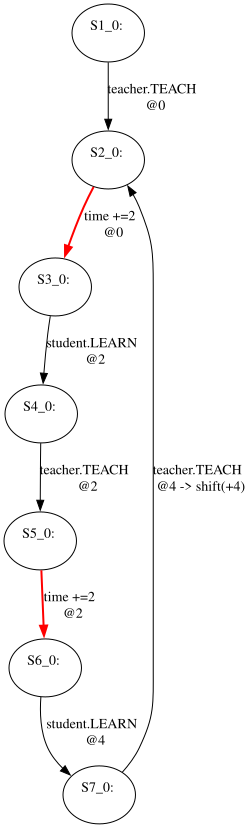
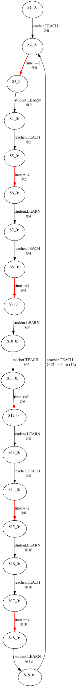
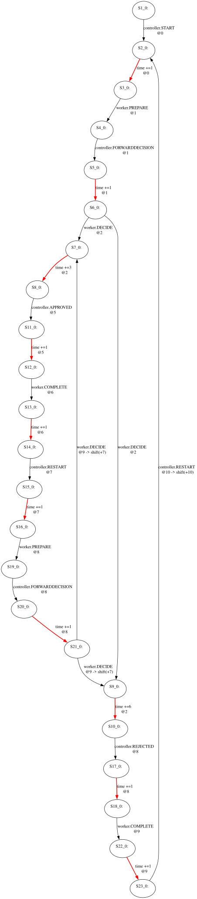
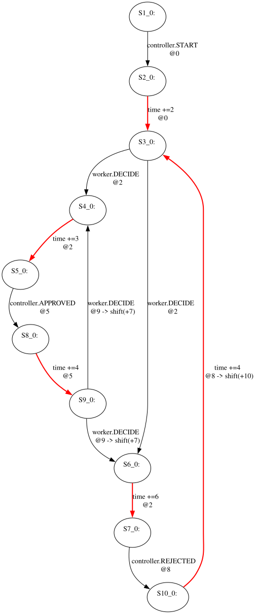

# Afra visualizations of the generated Rebeca models

These seven diagrams visualize the exact RMC-generated TTS fixtures committed
under `src/test/resources/rebeca-generated/`. The DOT files were produced by
Afra's official `org.rebecalang.statespacetransformer.StateSpaceTransformer`;
Graphviz was used only to lay out that DOT as SVG.

In Afra's notation, bold red edges advance time, while black edges execute
message servers. An `@N` suffix records the absolute execution time. A
`shift(+N)` annotation records Afra's clock normalization when a recurring
behavior starts again.

The observable sets used by `GeneratedRebecaModelsTest` are documented in
[rebeca-generation.md](rebeca-generation.md). Edges outside those sets are
treated as internal by the weak-timed comparison even though Afra displays
their original message-server names.

## Mood

Only `mood.LAUGH` and `mood.CRY` are observable. Thus the extra
`mood.HAPPINESS` and `mood.SADNESS` steps in `mood1` are hidden, and their
surrounding delays accumulate to the direct 5- and 8-unit waits in `mood2`.

### `mood1`

[](images/rebeca-generated/mood1.svg)

### `mood2`

[](images/rebeca-generated/mood2.svg)

## Teacher

Only `teacher.TEACH` is observable. The three models are pairwise weak-timed
bisimilar under the default `unit` semantics.

<table>
  <thead>
    <tr><th><code>teacher1</code></th><th><code>teacher2</code></th><th><code>teacher3</code></th></tr>
  </thead>
  <tbody>
    <tr>
      <td><a href="images/rebeca-generated/teacher1.svg"></a></td>
      <td><a href="images/rebeca-generated/teacher2.svg"></a></td>
      <td><a href="images/rebeca-generated/teacher3.svg"></a></td>
    </tr>
  </tbody>
</table>

## Chain

The observable set is `worker.DECIDE`, `controller.APPROVED`, and
`controller.REJECTED`. The two models are weak-timed bisimilar under the default
`unit` semantics.

<table>
  <thead>
    <tr><th><code>chain1</code></th><th><code>chain2</code></th></tr>
  </thead>
  <tbody>
    <tr>
      <td><a href="images/rebeca-generated/chain1.svg"></a></td>
      <td><a href="images/rebeca-generated/chain2.svg"></a></td>
    </tr>
  </tbody>
</table>

## Reproduce the diagrams

From the repository root:

```bash
python3 tools/afra_visualize.py --rankdir LR \
  src/test/resources/rebeca-generated/mood1.statespace \
  src/test/resources/rebeca-generated/mood2.statespace

python3 tools/afra_visualize.py --rankdir TB \
  src/test/resources/rebeca-generated/teacher1.statespace \
  src/test/resources/rebeca-generated/teacher2.statespace \
  src/test/resources/rebeca-generated/teacher3.statespace \
  src/test/resources/rebeca-generated/chain1.statespace \
  src/test/resources/rebeca-generated/chain2.statespace
```

The wrapper requires the local Afra distribution archive and Graphviz. Its
defaults match the workspace layout described in
[rebeca-generation.md](rebeca-generation.md); both paths are configurable from
the command line.
